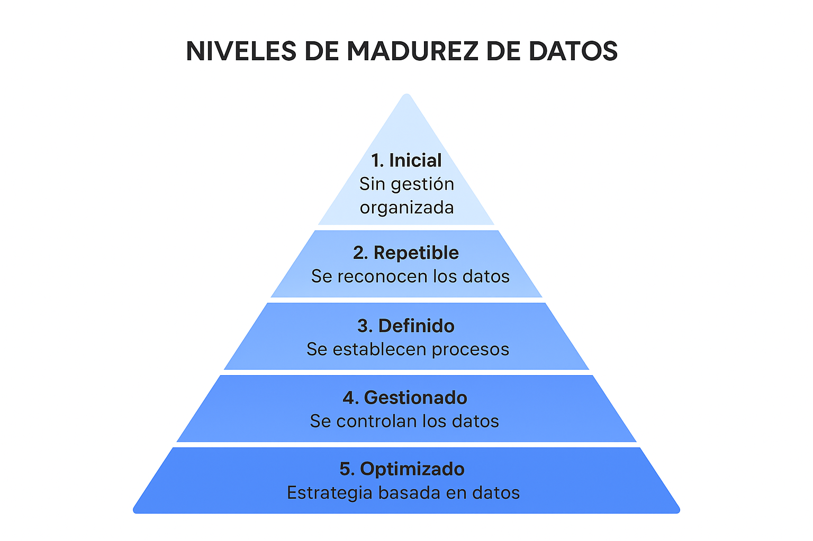

# Actividad en clase: Optimizando el stock para una PYME

**Consigna:**
En la heladería de Pedro se lleva mucho tiempo trabajando sin ningún tipo de estrategia enfocada al uso de los datos como oportunidad de mejora y manejo de stocks.
Recientemente, debido a la crisis sanitaria, el dueño ha cambiado su perspectiva y piensa que su empresa debería hacer un mejor uso de los datos históricos recolectados.

**Preguntas:**

* ¿Cómo piensan que esta información puede ayudar a tener un mejor control del stock de la heladería?
* ¿Qué nivel de madurez tendría esta empresa según el modelo *Data Management Maturity Model*?

---
## Data Management Maturity Model:

_Antes de responder esa pregunta... que es DMMM?_
## Niveles de Madurez de Datos (Data Management Maturity Model)

| **Nivel**                         | **Características principales**                                                                                                                                                                                              | **Ejemplo en la heladería de Pedro**                                                                                                  |
| --------------------------------- | ---------------------------------------------------------------------------------------------------------------------------------------------------------------------------------------------------------------------------- | ------------------------------------------------------------------------------------------------------------------------------------- |
| **1. Inicial (Ad hoc / Caótico)** | - No hay gestión organizada de los datos. - Cada área trabaja de manera aislada. - Decisiones basadas en intuición más que en evidencia.                                                                               | Pedro lleva las ventas en un cuaderno o en hojas sueltas, sin analizarlas.                                                            |
| **2. Repetible**                  | - Se reconoce el valor de los datos. - Se recopilan datos de forma básica, aunque sin estandarización. - Algunas prácticas se repiten, pero sin documentación formal.                                                  | Pedro empieza a registrar las ventas semanales en un Excel, pero no las usa aún para tomar decisiones.                                |
| **3. Definido**                   | - Se establecen procesos formales para la gestión de datos. - Existen reglas claras para recolectar y organizar la información. - Se implementan herramientas básicas de análisis (reportes, dashboards).              | La heladería usa un sistema digital de stock con alertas automáticas para reabastecimiento.                                           |
| **4. Gestionado (Managed)**       | - Se controla y mide la calidad de los datos. - Procesos estandarizados y supervisados. - Uso de análisis predictivo simple para anticipar escenarios.                                                                 | Pedro analiza patrones de venta por temporada y ajusta la compra de insumos para reducir desperdicios.                                |
| **5. Optimizado**                 | - La gestión de datos es parte central de la estrategia. - Uso de analítica avanzada: Big Data, Machine Learning, Inteligencia Artificial. - Decisiones estratégicas basadas en modelos predictivos y de optimización. | La heladería aplica un modelo predictivo que recomienda cuánto producir y comprar según clima, fechas especiales y ventas históricas. |

---

## Posibles soluciones

### 1. Implementar control de stock con base en datos históricos

* Analizar las ventas pasadas para identificar estacionalidad (ejemplo: mayor venta de helados en verano o fines de semana).
* Estimar la demanda futura con base en patrones históricos.
* Ajustar los pedidos de insumos en función de esa proyección para evitar quiebres de stock o sobreproducción.

**Beneficio:**
Menos desperdicio de materia prima, reducción de costos y disponibilidad de productos clave en los momentos de mayor demanda.

---

### 2. Avanzar en el nivel de madurez de datos (Data Management Maturity Model)

* Actualmente, la empresa se encuentra en un nivel **Inicial/Ad Hoc**, ya que no utiliza datos de forma estratégica.
* Una solución sería pasar al nivel **Repetible** o **Definido**, comenzando con:

  * Registro sistemático y digital de ventas e inventario.
  * Uso de dashboards simples (ej. Excel o Google Data Studio) para visualizar stock y tendencias de consumo.
  * Definir reglas básicas de reposición automática (por ejemplo: reordenar insumos cuando el stock baje de cierto umbral).

**Beneficio:**
Estructura mínima de gestión de datos que permite decisiones basadas en evidencia y no solo en la intuición del dueño.
