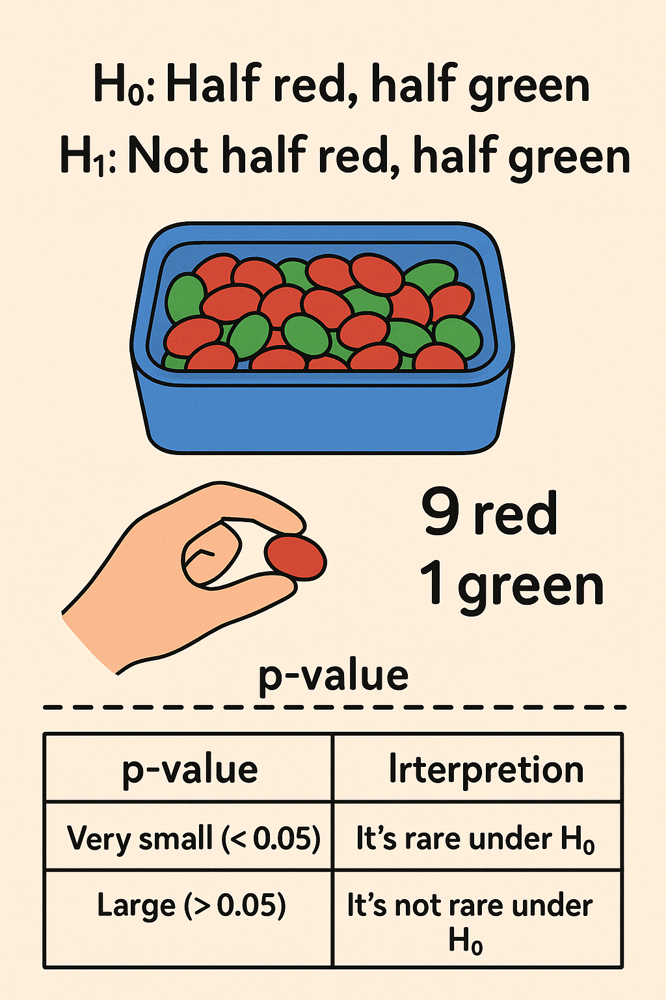

## **Estadística y Preprocesamiento**

### **1. Objetivos de la clase**

* Comprender las generalidades de la **estadística descriptiva**.
* Identificar el concepto de **serie de tiempo**.
* Diferenciar las **medidas de resumen**.
* Entender la **importancia del preprocesamiento de datos** y el manejo de **valores ausentes**.

---

### **2. Fundamentos de Estadística Descriptiva**

#### **2.1. Fuentes de información**

* **Unidad de observación**: conjunto de variables medidas sobre un mismo elemento.
* **Población**: conjunto total de unidades de observación posibles.
* **Muestra**: subconjunto de la población disponible para el análisis.

#### **2.2. Inferencia estadística**
_[Material Bibliografico Sobre estadistica basica](https://openstax.org/books/introducci%C3%B3n-estad%C3%ADstica/pages/9-1-hipotesis-nula-y-alternativa)_
Permite **inferir características poblacionales** a partir de una muestra mediante parámetros (media, proporción, varianza, desviación estándar).

Proceso general de prueba de hipótesis:

1. Formular hipótesis nula (H₀) y alternativa (H₁).
2. Definir nivel de significancia (α).
3. Calcular estadístico de prueba.
4. Obtener p-valor.
5. Tomar decisión (rechazar o no H₀).
6. Redactar la conclusión.

El **p-valor** representa la probabilidad de observar resultados tan extremos como los obtenidos si H₀ fuera cierta.

---

### **3. Variables y tipos de datos**

#### **3.1. Noción de variable**

Una **variable** representa una característica observable y medible que puede asumir distintos valores.

#### **3.2. Tipos de variables**

* **Cuantitativas**: numéricas.

  * *Discretas*: valores enteros.
  * *Continuas*: valores reales.
* **Cualitativas**: categóricas.

  * *Nominales*: sin orden implícito.
  * *Ordinales*: con jerarquía u orden.
* **Lógicas**: verdadero/falso.
* **Metadatos / Alta cardinalidad**: identificadores sin valor analítico directo.

---

### **4. Medidas de resumen**

#### **4.1. Para variables cuantitativas**

* **Media**: promedio de los valores.
* **Mediana**: valor central de los datos ordenados.
* **Moda**: valor más frecuente.
* **Varianza (s²)**: dispersión promedio respecto a la media.
* **Desvío estándar (s)**: raíz cuadrada de la varianza, expresada en las mismas unidades.

#### **4.2. Para variables cualitativas**

* Cálculo de frecuencias por categoría.
* Identificación de la **moda categórica**.

---

### **5. Distribuciones de variables**

* Las variables **cuantitativas** presentan una **distribución** que puede ser:

  * **Simétrica (normal)**: media ≈ mediana ≈ moda.
  * **Asimétrica**: sesgo hacia derecha o izquierda.
* **Distribución normal**: fundamental en inferencia estadística.

  * 68% de los datos: ±1σ
  * 95%: ±2σ
  * 99.7%: ±3σ

Los valores más allá de ±3σ suelen considerarse **atípicos**.

---

### **6. Intervalos de confianza**

Permiten estimar el rango donde se espera encontrar un **parámetro poblacional** con determinado nivel de confianza (ej. 95%).
Dependen del tamaño de muestra y la varianza.

---

### **7. Preprocesamiento de datos**

#### **7.1. Concepto**

Proceso de **limpieza y transformación** de datos crudos para mejorar su calidad antes del análisis o modelado.

#### **7.2. Etapas principales**

* **Data Cleaning**: detección y corrección de errores, outliers y valores nulos.
* **Data Integration**: combinación de fuentes heterogéneas.
* **Data Transformation**: normalización y agregación.
* **Data Reduction**: selección y reducción de variables.
* **Data Discretization**: transformación de datos continuos a categorías (One Hot Encoding, LabelEncoder).

---

### **8. Detección de Outliers**

#### **8.1. Definición y tipos**

Valores que se alejan notablemente de la tendencia general.

* **Univariados** o **multivariados**.
* **Puntuales**, **contextuales** o **colectivos**.

#### **8.2. Métodos de detección**

* **Boxplot (IQR)**: valores fuera de [Q1 − 1.5·IQR, Q3 + 1.5·IQR].
* **Z-score**: valores con |z| > 2 o 3.
* **Distancia Euclídea multivariada**.
* **Modelos estadísticos o probabilísticos**.

- [Anscombe](00_anscombe_sample.ipynb): El ejemplo clásico de **Anscombe** demuestra que indicadores iguales pueden ocultar distribuciones muy diferentes, subrayando la importancia de **graficar los datos**.

---

### **9. Manejo de datos ausentes**

#### **9.1. Estrategias**

* Eliminación de filas con nulos.
* Relleno mediante:

  * Valor constante o categoría “Desconocido”.
  * Media, mediana o moda.
  * Modelos predictivos (*e.g.*, regresión o librerías como **Datawig**).

#### **9.2. Herramientas en Python**

- [Imputer](/05_visualizaciones_avanzadas/clase_teorica/00_extra_imputers.md)

* `SimpleImputer` (Scikit-learn): reemplazo sistemático.
* `interpolate()` (pandas): interpolación lineal o polinómica.
* `Datawig`: imputación mediante redes neuronales.

---

## **10. Cierre**

La estadística descriptiva y el preprocesamiento constituyen las **bases del Análisis Exploratorio de Datos (EDA)**, etapa indispensable antes de aplicar cualquier modelo de machine learning.

---

## **Material adicional sugerido**

* **Notebook interactivo de ejemplos**:
  [Anscombe’s Quartet en Python (Google Colab)](https://colab.research.google.com/drive/1Mwq6rJ-E-yImO7Yw7mg7NonQy4e-Pi4N?usp=sharing)

* **Lecturas complementarias:**

  * “*Exploratory Data Analysis*” — John Tukey (1977).
  * “*Practical Statistics for Data Scientists*” — Peter Bruce & Andrew Bruce (O’Reilly, 2020).
  * “*Introduction to Statistical Learning*” — Gareth James et al. (Springer, 2023).
  * “*Python for Data Analysis*” — Wes McKinney (O’Reilly, 2022).

* **Cursos gratuitos recomendados:**

  * [Khan Academy – Estadística y probabilidad](https://es.khanacademy.org/math/statistics-probability)
  * [Coursera – Data Science: Foundations using R](https://www.coursera.org/specializations/data-science-foundations-r)
  * [Datacamp – Exploratory Data Analysis in Python](https://www.datacamp.com/courses/exploratory-data-analysis-in-python)
